<div align="center">
  <a href="https://github.com/filippofinke/cad-studio">
    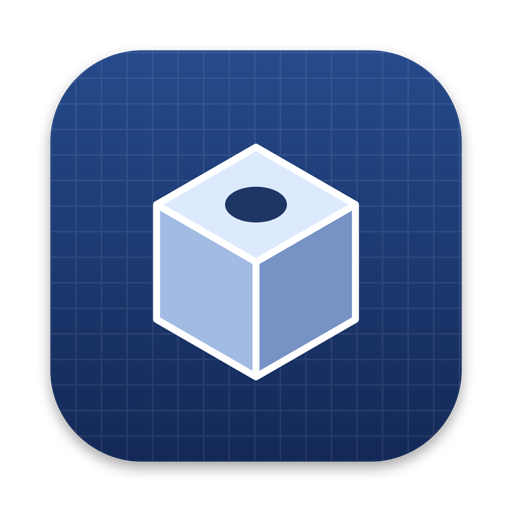
  </a>
  <h3 align="center">CAD Studio</h3>
</div>

> Describe a part, get a printable model. A native macOS CAD studio powered by the coding agent on your Mac (Claude Code or Codex) and build123d.

Type "a print-in-place planetary gearbox with four colors, animated with real gear ratios" and CAD Studio has your coding agent write a parametric `model.py`, run it with build123d and hand you a 3D model, an ISO technical drawing and files ready for your slicer. Every change is a new version you can go back to.

<p align="center">
  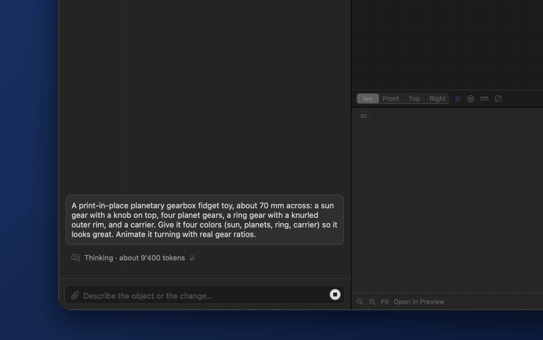
</p>

<p align="center"><a href="https://filippofinke.github.io/cad-studio/">Website</a> · <a href=".github/demo.mp4">▶︎ Watch the narrated demo (MP4, with sound)</a></p>

## Features

- [x] Chat with an agent that writes and fixes parametric build123d scripts for you
- [x] Live 3D viewer with orbit, zoom, pan, grid, wireframe and multi-color 3MF parts
- [x] Measure distances and cut sections through the model
- [x] Animate mechanisms with a physics simulation (masses, springs, friction) and per-frame collision checks
- [x] Multi-part models: assembled, exploded or print-plate view, show, hide or keep parts together
- [x] Print plate with every part oriented and laid out for printing (`plate.3mf`, opened in your slicer)
- [x] Floating parameter panel with sliders: tweak dimensions without calling the agent
- [x] ISO technical drawings (first-angle projection): assembly with parts list plus one sheet per part, as a multi-page PDF
- [x] Version history: jump back to any generation, chat and context included, and compare versions in 3D
- [x] Attach or paste (⌘V) reference images, sketches, PDFs and STEP/STL files to the chat
- [x] Export STEP, 3MF, STL, PDF drawing and `model.py` as one ZIP
- [x] Printer-aware design rules for FDM, multi-material, resin and SLS, in mm, cm, m or inches
- [x] Drag panels anywhere: chat left, right or at the bottom, layout saved per project
- [x] English, Italian, German and French

## Screenshots

Every screenshot below is from the same project: a print-in-place planetary gearbox, from the first launch to version 2.

**Set up once, then describe your part.** Pick your printer and units on first launch, create a project and type what you need.

| First launch | Describe the part |
| :---: | :---: |
| 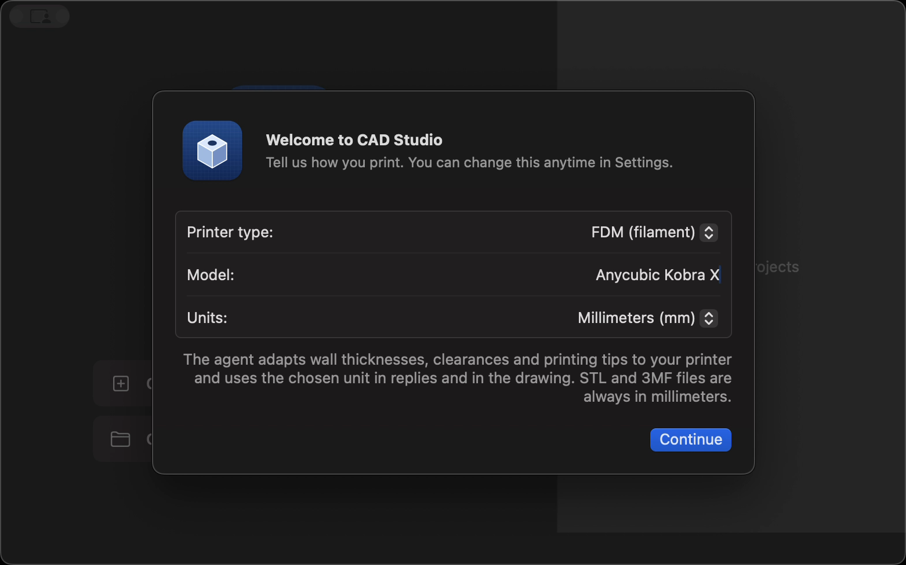 | 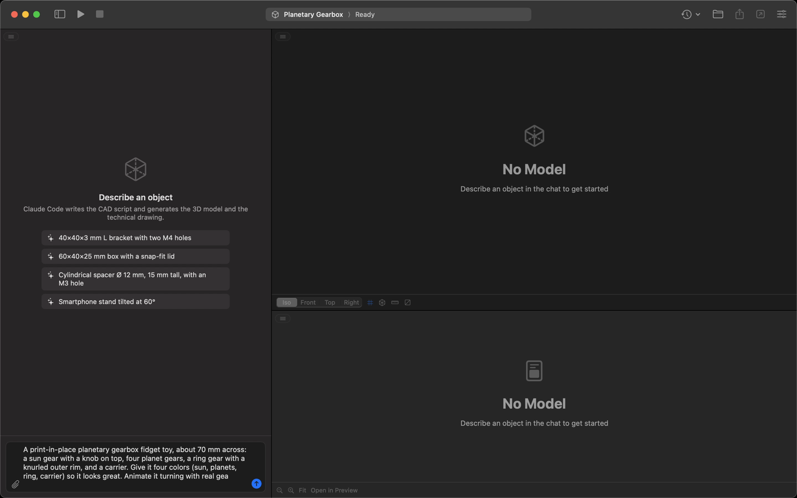 |
| **The agent at work** | **The finished gearbox** |
| 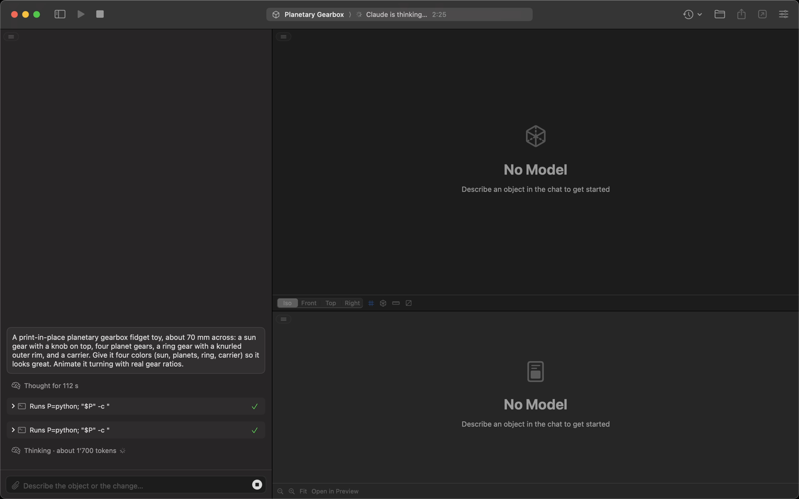 | 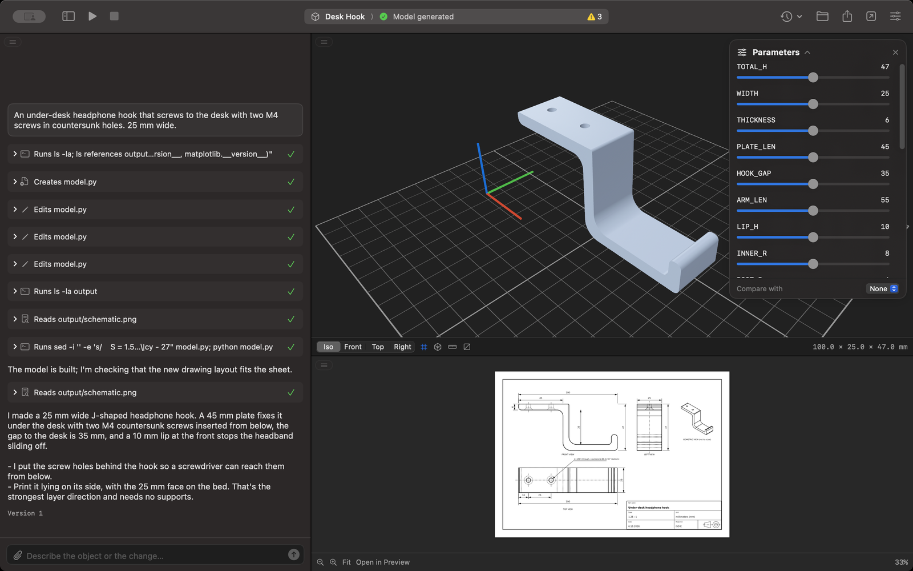 |

**Parts, motion and drawings.** Explode the assembly, play the simulated motion and flip through the drawing sheets.

| Exploded view | Simulated motion |
| :---: | :---: |
| 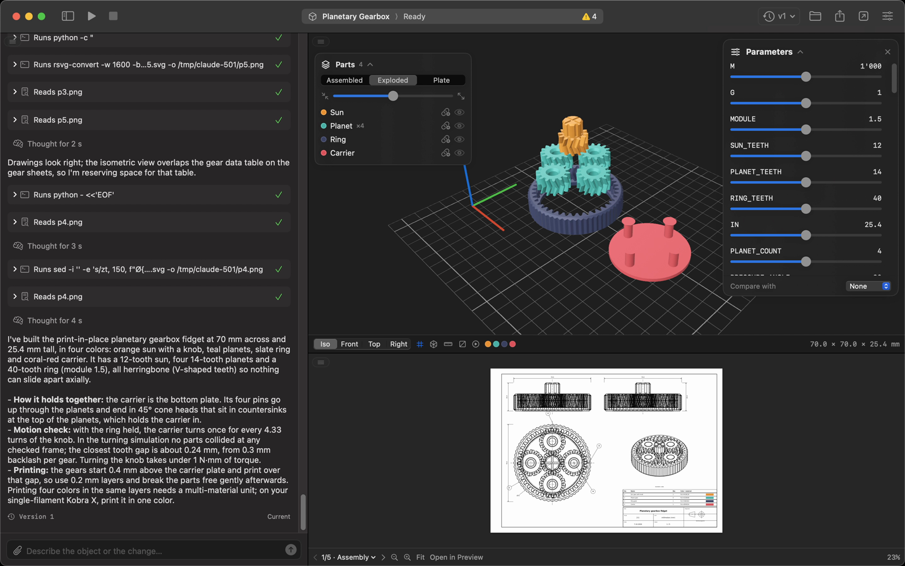 |  |
| **Edit parameters without the agent** | **Measure distances** |
| 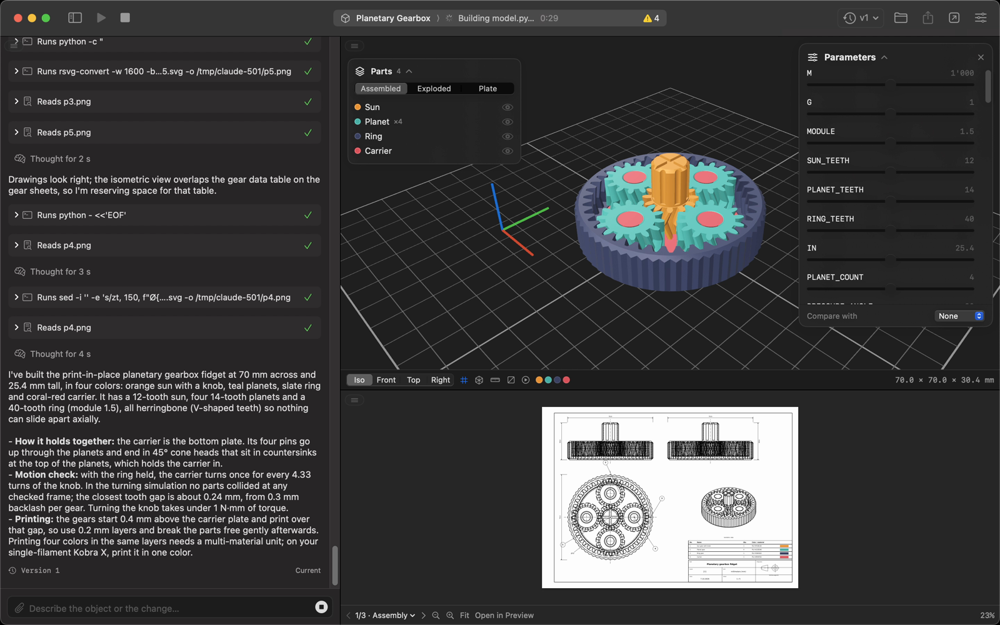 | 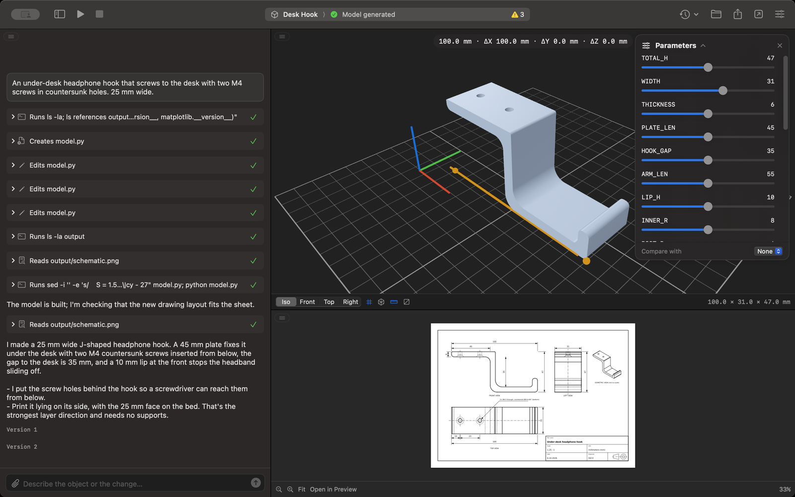 |
| **Section view** | **One sheet per part** |
| 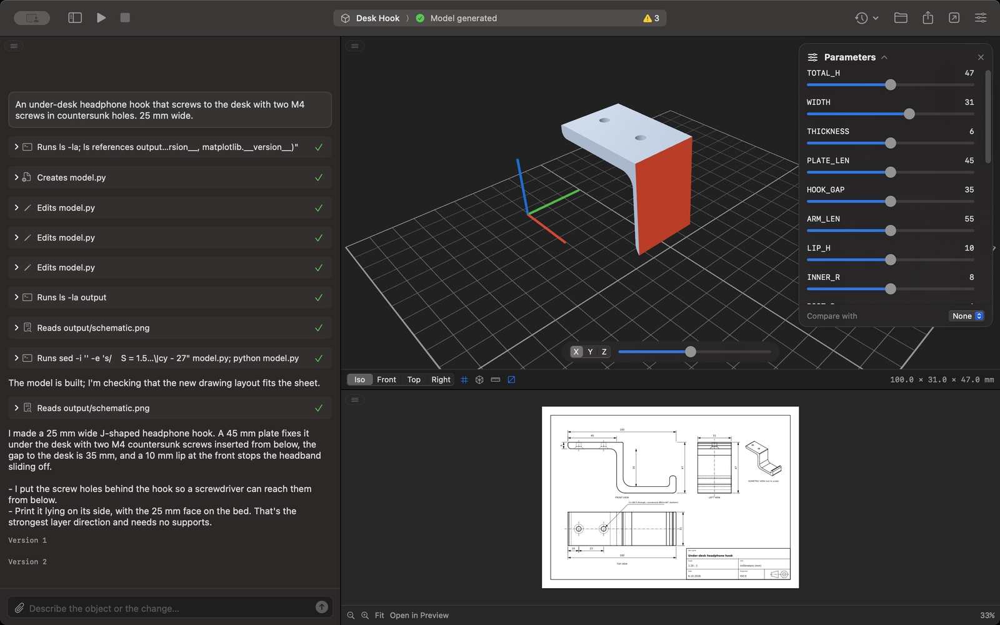 | 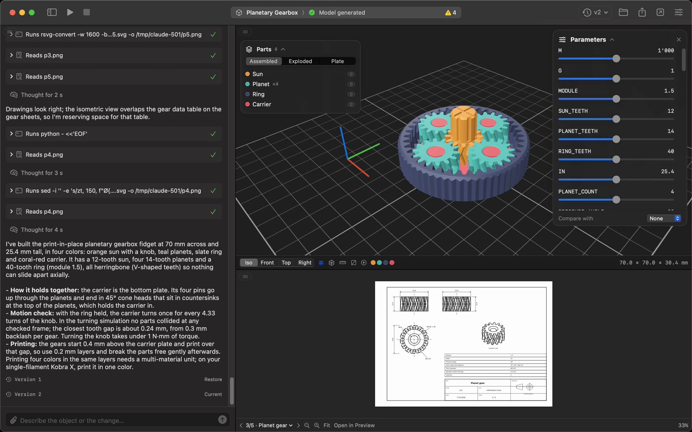 |
| **Ask for a change: version 2** | **Compare with version 1** |
| 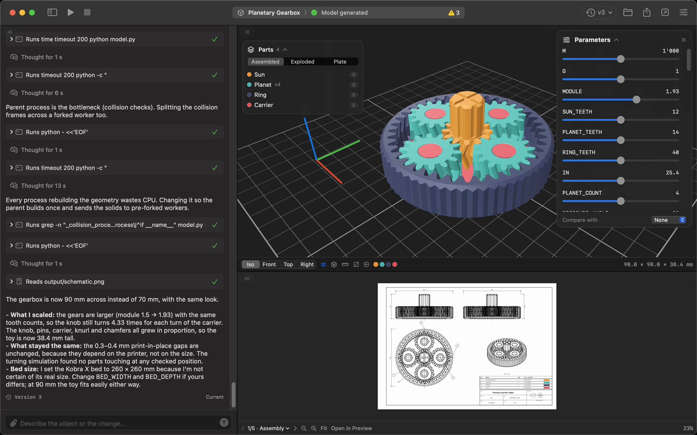 | 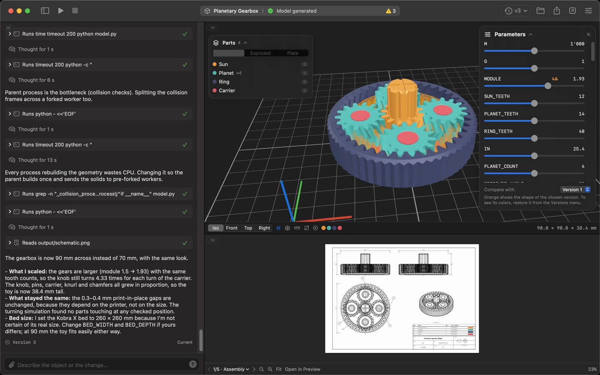 |
| **Chat on the right** | **Chat at the bottom** |
| 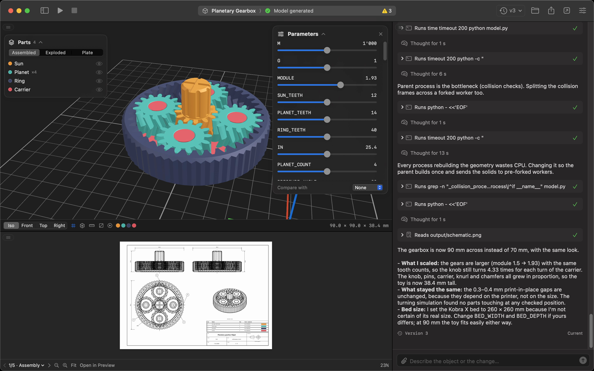 | 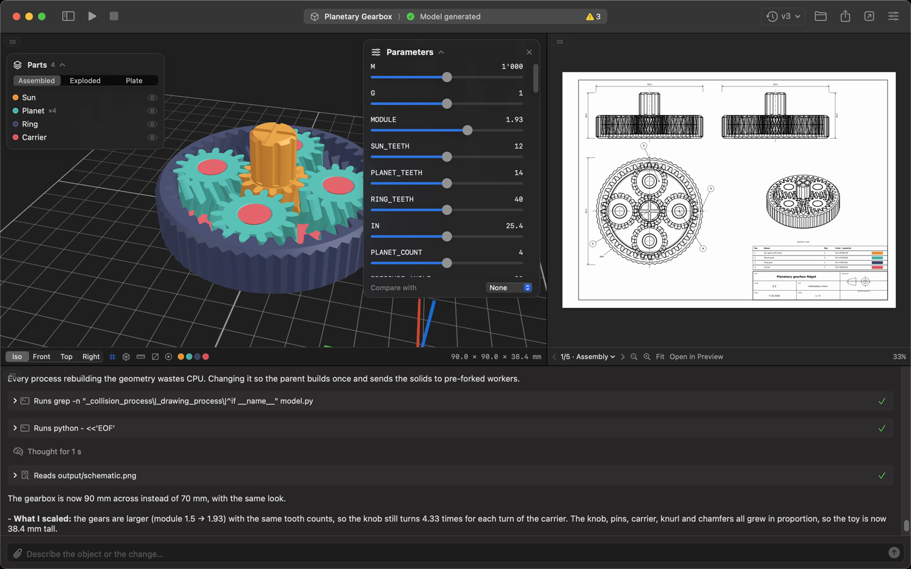 |

## Quick Start

Prerequisites

- macOS 15 or later
- [Claude Code](https://claude.com/claude-code) signed in (run `claude` once in Terminal), or [Codex CLI](https://developers.openai.com/codex/cli) signed in (`codex login`); pick one in **Settings → Agent**
- [uv](https://docs.astral.sh/uv/) or Python 3.10–3.13, used to install build123d on first launch

Download

Grab `CADStudio.dmg` from the [latest release](https://github.com/filippofinke/cad-studio/releases/latest) and drag CAD Studio into Applications. The app isn't notarized, so the first time macOS blocks it: open **System Settings → Privacy & Security** and click **Open Anyway**, or run:

```bash
xattr -dr com.apple.quarantine "/Applications/CAD Studio.app"
```

Build from source (needs Xcode 16 or later)

```bash
git clone https://github.com/filippofinke/cad-studio.git
cd cad-studio
./build.sh --install
```

This builds a universal `CAD Studio.app`, copies it to `/Applications` and launches it. `./build.sh --dmg` builds `build/CADStudio.dmg`. You can also open `CADStudio.xcodeproj` and press ⌘R.

## How it works

Every project is a folder. CAD Studio runs the agent installed on your Mac in headless mode (`claude -p --output-format stream-json`, or `codex exec --json` in its workspace sandbox) inside that folder, with a CAD system prompt that asks for a single parametric `model.py`. The agent runs the script with a dedicated Python environment (`~/Library/Application Support/CAD Studio/venv`, with build123d, matplotlib and numpy) until it produces:

```
<Project>/
├── model.py              # parametric build123d script
├── references/           # images attached in the chat
├── output/
│   ├── model.3mf         # main model, with part colors
│   ├── model.stl
│   ├── model.step
│   ├── plate.3mf         # parts laid out ready to print
│   ├── schematic.svg / .png / .pdf   # page 1 + multi-page PDF
│   ├── schematic-2.svg …  # one sheet per part
│   ├── animation.json    # optional: simulated motion, values and collisions
│   └── manifest.json     # size, volume, parameters, warnings
└── .cadstudio/           # chat, session, logs and versions
```

The app streams the agent's text and tool calls into the chat, watches `output/` and reloads the 3D view and the drawing as soon as files change. Each successful generation is copied to `.cadstudio/versions/<n>/` together with the chat and a forked Claude session, so going back to a version also restores what the agent remembers.

## Notes

- Generations use your Claude Code or Codex plan. A simple part takes one to two minutes; a complex mechanism can take half an hour.
- By default the agent ignores your personal configuration (Claude Code hooks, plugins and MCP servers, Codex `config.toml`). Turn this off in **Settings → Advanced** if your login depends on them.
- **Settings → Agent → Restricted Bash** (Claude Code) limits the agent to the project's Python interpreter and read-only commands.
- Files are always in millimeters; the chosen unit is used in replies and drawings.

## Contributing

Open a pull request against `main` with a [Conventional Commits](https://www.conventionalcommits.org) title (`feat: …`, `fix: …`). PRs are squash-merged, and [release-please](https://github.com/googleapis/release-please) turns them into a release PR that bumps the version and updates the [changelog](CHANGELOG.md). Merging it publishes a GitHub release with the DMG attached.

## Author

👤 **Filippo Finke**

- Website: [https://filippofinke.ch](https://filippofinke.ch)
- Twitter: [@filippofinke](https://twitter.com/filippofinke)
- GitHub: [@filippofinke](https://github.com/filippofinke)
- LinkedIn: [@filippofinke](https://linkedin.com/in/filippofinke)

## Show your support

Give a ⭐️ if this project helped you!

<a href="https://www.buymeacoffee.com/filippofinke">
  
</a>

## 📝 License

Copyright © 2026 [Filippo Finke](https://github.com/filippofinke).<br />
This project is [MIT](./LICENSE) licensed.

***

_Not affiliated with Anthropic._
